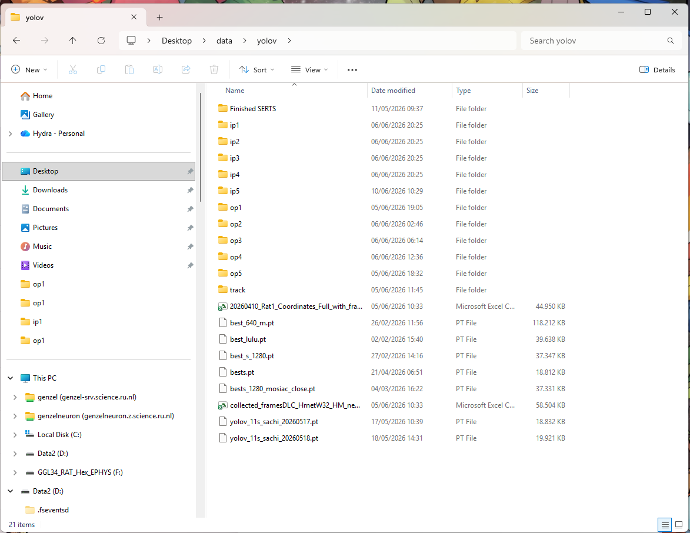
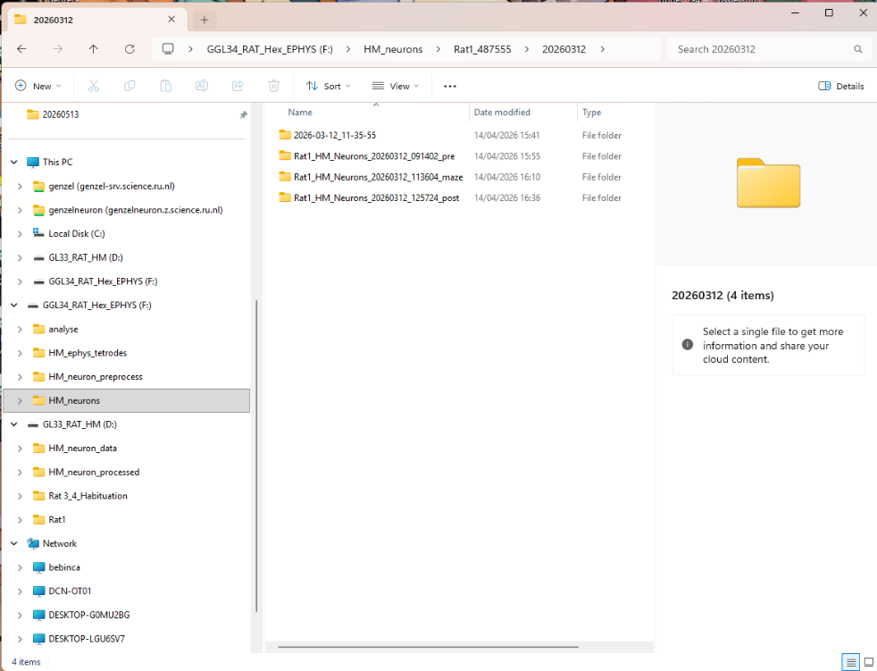
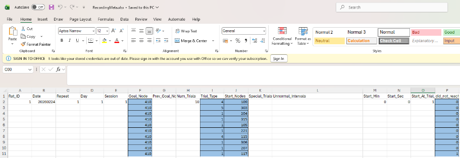
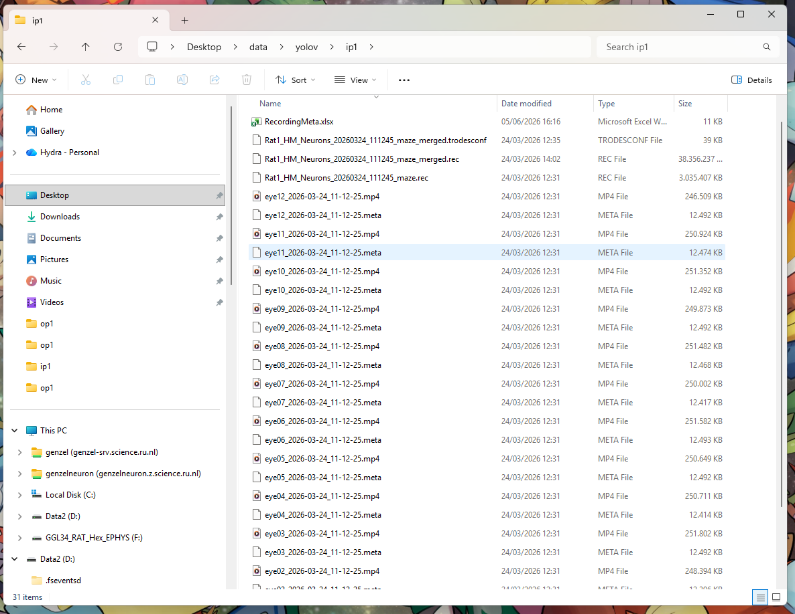
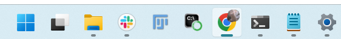
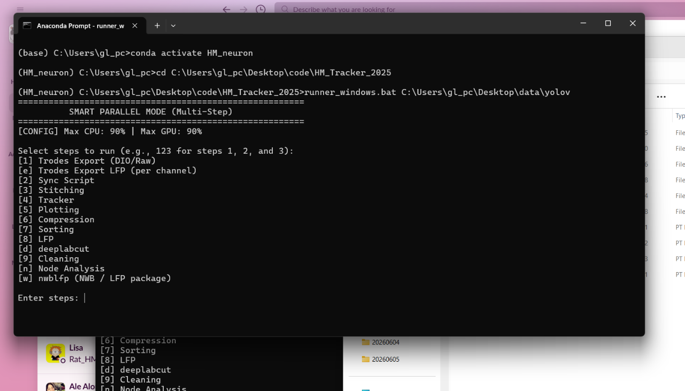
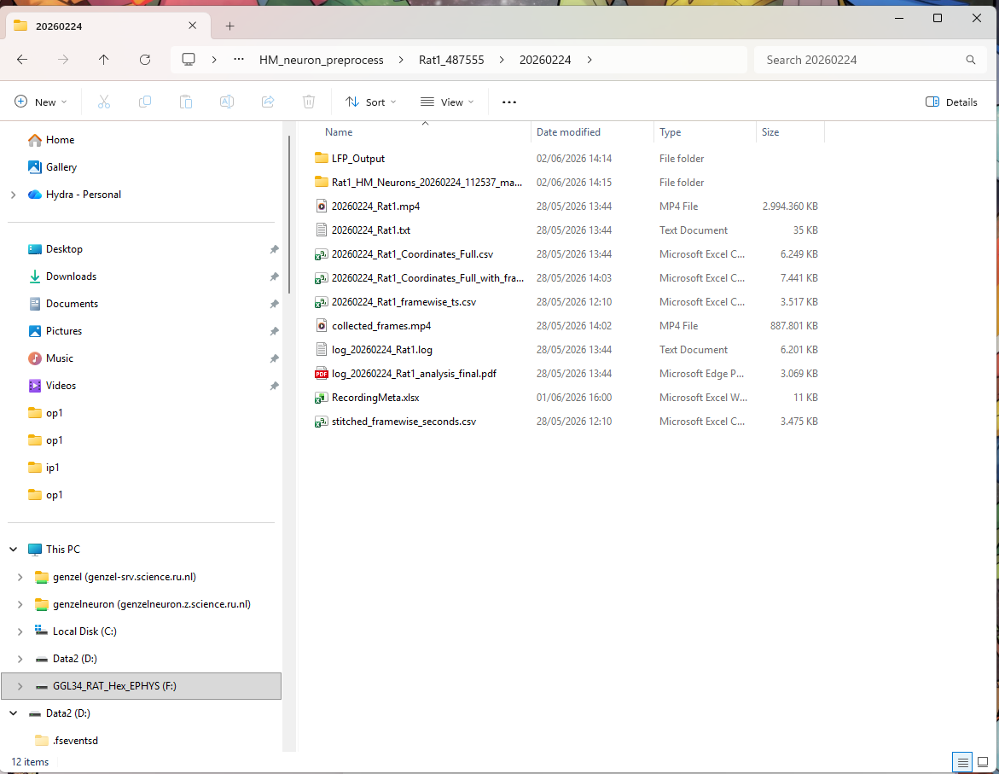
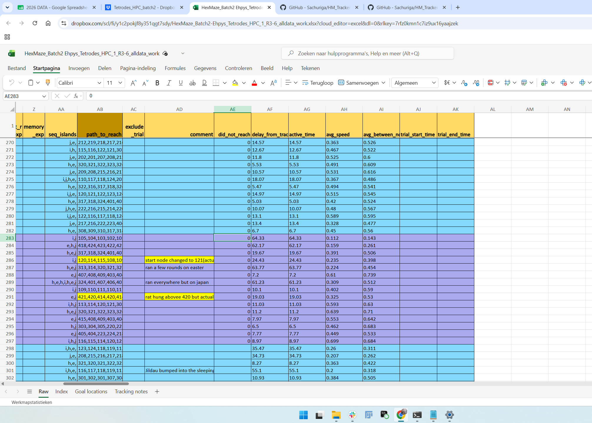
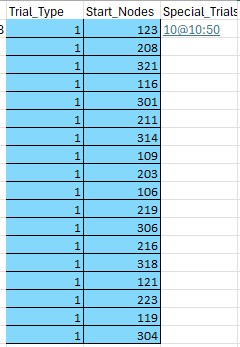

**Author: Jill Gerritsen** 

# Protocol Tracking HexMaze Rat

You can run the tracking using a GPU on a computer that has installed the tracker. This computer needs access to the training videos on a drive. You can reach it via AnyDesk to track remotely.

## Folder structure for tracking

- On the tracking PC in `data->yolov` create ip and op folders. (Up to 5 at the same time)
- Name the input folders: ip1-5 and name the output folder op1-5.

*(Example of what Yolov folder should look like)*

## Data Collection

- Open the tracking progress file to see which session from which rat needs to be tracked.
  - HM_neuron data: <https://docs.google.com/spreadsheets/d/1-3VW-kLysz_7Pv_-mLIgnl7dWZEdnlGQ0hOaBZYpg2c/edit?usp=sharing>
- To find the data that needs to be tracked you need to access the drives.
  - Data from Rat 1&2: on GL34
  - Data from Rat 3&4: on GL34 and GL33 (all data should be on GL34)
- Check whether you are going to track maze data or sleep data

### Maze data

- **Data gathering**
  - Open the corresponding data folder
  - Open the first folder and copy all video files (meta and mp4 files of **all eye videos** 1-12 of the training sessions).
  - Next open the maze folder and copy **2 REC files** and **TRODESCONF** file
    - Note: when tracking non-implant animals these files do not exist. You can continue with only the videos

*(example of gathering maze data, top folder contains eye videos, maze folder contains REC and Trodesconf files)*

- **Metafile**
  - For each session a filled **metafile** needs to be inserted in each ip folder. This file can be copied from old ip folders or from the Dropbox
  - Using the all_data file in the dropbox you can fill in the:
    - **Rat_ID**: only the number is require
    - **Date**: this date will show on the files in the op folder
    - **Repeat**
    - **Day**
    - **Session**
    - **Goal_Node** of all trials
    - **Number of trials**: this number of trial will be tracked,
    - **Trial type**: insert of all trials
    - **Start nodes**: insert of all trials
    - **Did not reach**: 0: did reach, 1: did not reach, insert of all trials
    - Note: all other columns can be kept empty

*(Example of what the metafile should look like)*

*(Example of files in the ip folders)*

### Sleep data

- **Data gathering**
  - For the sleep data only need the files in either the presleep or postsleep folder. You need to copy the REC and Trodesconf files (all files).
  - Note: make for every sleep session a different ip folder. So for a day of sleep data you need 2 ip folders, one for presleep and one for postsleep.

*(example of sleep data gathering, either post or presleep folder needed)*

## Starting the Tracker

- Before starting the tracker you need to check:
  - PC storage: at least 700GB should be free for tracking ephys data
    - Note: less storage is needed for the non-ephys data and sleep data
  - Ip folders: make sure that all needed files are properly copied into the folders
- Open Anaconda Prompt which can be found in the taskbar

- Run `conda activate HM_neuron`
- Run: `cd C:\Users\gl_pc\Desktop\code\HM_tracker_2025`
- Run: `runner_windows.bat C:\Users\gl_pc\Desktop\data\yolov` and press enter
  - Note: if the ip and op folders are located somewhere else copy that path instead
- A menu will show with different number and functions. Depending on what data is being tracked a different sequence numbers will be used.
  - **Maze data**: run `1234567de89.`
  - **Sleep data:** run `e8`

*(This is what the anaconda terminal should look like before tracking)*

## Verifying the tracker output

- After tracking check the output folders to make sure that all expected files are created and they are not empty.

### Maze data

- Ip folder should contain:
  - LPF_Output folder
  - Rat_HM_Neurons_date_maze_merged.raw_group0_sorting_output
    - Note: only when the rat has ephys data
  - Date_Rat. Mp4 file: containing the tracked video of the session
  - Date_Rat Txt file: contains the path of the tracked rat
  - Date_Rat_Coordinates_Full.csv
  - Date_Rat_Coordinates_Full_with_frames.csv
  - Date_Rat_framewise_ts.csv
  - Collected_frames.mp4
  - Log_ Date_Rat.log
  - Log_ Date_Rat_analysis_final.pdf
  - RecordingMeta.xlsx
  - Stitched _framewise_seconds.csv: only present in ephys animals

*(example of what the ip folder should look like)*

### Sleep data

- Ip folder should contain only the LPF_Output folder
  - Note: only steps 8e are ran so there will only be a LFP output.

## Validating the output files (Maze only)

- Compare the Log_ Date_Rat_analysis_final.pdf vs the metafile to make sure that:
  - The number of trials aligns
  - All trials are correctly labelled as **did not reach** or **did reach**
    - Note: sometimes when a trial is labelled as did not reach, the rat still reaches the end due to guiding, this is not an issue, you can continue.
- Check the tracked video to check that
  - all trial have the correct start node
  - there are no premature trial ends
  - the rat does not pass the next start node after completing the previous trial
- If either the tracked video or pdf file does not look completely right you need to make some changes to the ip folder (mainly the metafile).
  - Note: easiest way to find what went wrong during the tracking is comparing the pdf and the tracked video for the trial containing the issue
  - Note: check troubleshooting common tracker issues to find possible solutions

## Path/node analysis (Maze only)

- Download the all_data file from the Dropbox to insert all path information into
- In the finished op folder the metafile and txt file, contain the path the rat took.
  - Note: easiest way is to copy the path_to_reach column in the metafile
- Before copying all the paths into the all_data file, check these paths in a few ways
  - Check that the path starts at the correct start node and ends at the correct goal node (depending on the trial type). If it does not, make the correct adjustments and add a comment in the "Tracking notes" sheet in the excel file.
  - Browse through the video file and check for tracking mistakes and ensure to adjust the path in the excel file. These adjustments may be:
    - If the tracker skipped a node, write the skipped node into the path.
    - If there are inconsistencies in the .txt path that is not reflected in the video (eg: doubles/ repeats like 111,112,111,112), adjust the path.
      - Note: it is possible that the rat did take this path, then you can leave the path as it is.
    - If the start node is not the first node in the path but the rat is placed there you can add the start node at the beginning of the path
  - Note: if the path is not present properly in the metafile you can copy it from the txt file
- After making sure that all the paths are correct insert the path_to_reach, delay_from_tracker, active_time, avg_between_nodes, trial_start_time, trial_end_time.
  - Note: for non_ephys animals there is no trial_start_time and trial_end_time

*(example of all_data file with path analysis inserted)*

- After adding the paths to the all_data excel file, insert the file into a ip folder
- Open anaconda and run: `n`.
- After step n a excel file will be added to the op folder

## Saving the data

- After the data is correctly tracked and all path information has been added to the all_data file, the data in the op folder needs to be saved.
  - Note: you only need to save the op folder since all the data in the ip folder is already present on the drive.
- All the tracked data should be saved onto the GL34 for the HM_neuron data
- The data will be saved differently for maze and sleep data
  - **Maze data:** in the HM_neuron_preprocess folder select the rat and create a folder with the tracked date and insert the data.
  - **Sleep data:** in the HM_neuron_LPF folder select the rat and create a folder with the tracked date and insert the data.
- After you successfully copied all data in this folder onto the drive you can check the box in the google sheet file corresponding to the session you finished.

## Solving common tracker issues (Maze only)

- The number of trials in the PDF does not align with the number in the metafile. This can be due to multiple different reasons
  - The rat is placed in the wrong start node.
    - When the rat gets placed in the wrong start node that is more than one node away the tracker will not start. The tracker will only start tracking again if the rat passes the start node. This can affect later trials as well
    - Solution: edit metafile start nodes to match the one in the video and rerun Anaconda with only step `45d`.
  - The rat walked through the next start node after finishing a trial
    - Solution: in the metafile in the special_trial add the time the next trial start by adding `trial_number@time_when_next_trial_starts` then rerun step `45d.`
    - Example: after the rat finished trial 9 he walks through the start node of trial 10, this makes the tracking of trial 10 not accurate. Let's say trial 10 actually starts at 10:50. Solution: add `10@10:50` in the special_trial`s column

  - The researcher stays to close to the rat after placing it down or when walking away
    - This makes the trial end early and can affect later trials as well
    - Solution: add the time of the next trial in the same way as mentioned above. So by adding `trial_number@time_when_next_trial_starts` then rerun step `45d.`
- Random missing files
  - A full PC can be the cause of missing files or trials
    - Solution: clear storage and rerun the steps needed for the missing files
  - An error in anaconda or a step that was stopped during tracking
    - This can be checked by scrolling through the anaconda terminal, however the way to fix this by rerunning the missing step
- One trial ends too quickly or too late
  - The trial type is most likely noted wrong in the metafile. This can be checked by comparing the metafile and all_data file.
    - If the metafile and all_data file are the same, there can still be a wrong trial type. This can be checked by watching the video of the problem trial and verifying that the trial number in the file matches with what is happening in the video.
      - Solution: correct the trial type and rerun steps `45d` of the tracker.
  - Missing or empty files
    - The files that miss the most often are:
      - LPF file: most commonly caused by a full storage of the PC at the time of running the tracker.
        - Solution: clearing the pc and rerunning step 8
      - Maze merged file: can be caused by a full storage
        - Solution: rerunning step 7 sorting.
        - Note: this is the step which takes the longest, and can take up to 6 hours. If the tracker is needed for less time consuming tasks it is better to perform those before.
      - Missing seconds file:
        - Solution: rerunning step 12

## Other issues with the tracker

- When noticing mistakes, you have never seen before or that are not mentioned in the protocol you can send a message in the HM_tracking channel
  - Make sure to
    - Tag your supervisor
    - Insert pictures of everything for example:
      - the anaconda terminal with possible errors
      - Correctly filmed metafile compared to wrongly tracked video
      - Missing files in op folder
      - Pictures of what exactly is going wrong (if you know of course)
  - Tip: it is better to ask earlier rather than keeping it to yourself and getting stuck in the tracking process.
