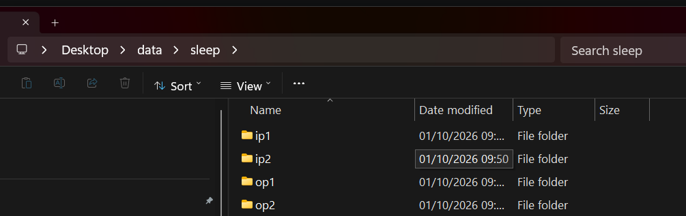
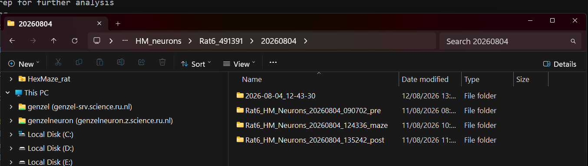

**Author: Nick Abou**   
**Edited from the protocol by: Jill Gerritsen**  
**This document is a work-in-progress and incomplete**  

# The Rat HexMaze Pre-Processing Pipeline, using the GenzelTracker

The GenzelTracker app is a multi-functional tool that can be used for:
- Video stitching, prep for further analysis
- Basic video tracking
- Data prep for sleep scoring and spike sorting  

## 0. Before you do anything...

IMPORTANT: Check the computer's free disk space before you add or process files!  
A folder with input and (pre-)processed output files from just one day of sleep recording can take up to ~600 - 700 GB of space.  
A folder with input and output files from one session of maze recordings can take up to  ~100 GB of space.  

## 1. Preparing the folder structure

The GenzelTracker app needs a specific folder structure to function properly. 

The sleep data should generally be handled in: ...\Desktop\data\sleep  
The maze data should generally be handled in: ...\Desktop\data\maze  

In this folder, input and output folders should be created. Name them as "ip1" (input) and "op1" (output).  
Pre-sleep and post-sleep recordings should be allocated to seperate input folders.  
In order to process multiple data files at once, you can create as many ip and op folders as desired. (ip2, ip3, op2, op3, etc.)  
The number in the folder names should be increased appropriately, and there should always be both an ip and op folder with the same number.  

## 2. Adding the input (recording files)

The recording files are stored on the external hard drives in the office. The pre-process spreadsheet shows the locations of specific recording sessions.  
When you copy recording files to a certain PC, please note it in the spreadsheet.

The keyword here is "copy". Do NOT move files out of the external hard drives, only copy them to the office PC's drive. 
Preferably using Ctrl + C & Ctrl + V.

The session folders on the external hard drives can have 4 types of folders:
- A folder with just the session date as its title: This folder contains the hex maze video recordings.
- _pre: Contains the pre-maze sleep ephys recording.
- _maze: Contains the maze ephys recording (merged).
- _post: Contains the post-maze sleep ephys recording.

If a folder contains a .trodesconf file, include this with the .rec as input.

Be aware that transferring these large files can take some time.  

## 3. Running the GenzelTracker GUI

In an Anaconda python terminal, run:  
`conda activate HM_neuron`  
`genzeltracker`

The functionality of the GenzelTracker is divided into "steps", each having its own single letter or number code. Specific processing tasks can be performed by combining certain steps. There are several presets available to assist in step selection.

For the data root, select the root folder containing the ip and op folders.

Important presets:
- "Tracker implanted": Processes maze video and prepares data for sleep scoring and spike sorting.
- "Tracker non-implanted": Only processes maze video.
- "Prepare for sleep scoring and spike sorting": Prepares the data for sleep scoring and spike sorting.
- "Prepare for spike sorting": Prepares the data for spike sorting.
- "Prepare for sleep scoring": Prepares the data for sleep scoring.

Note that most of these processes can take multiple hours to finish. It is therefore advisable to let the GenzelTracker run overnight.

## 4. Checking the video & Running the analysis softwares

### 4.1 Sleepscoring

In an Anaconda python terminal, run: 
`conda activate sleep_score` or `conda activate sleepscore`  
And then: `sleepscore`

In the sleepscore program, choose your op folder as the data folder.  
Your op folder should contain an .nwb file after processing for sleepscoring.  
Sleepscore save data will be stored inside the .nwb file.  

### 4.2 Spike sorting

In an Anaconda python terminal, run: `conda activate phy`    
Navigate to ...\phy_export in your op folder, for example:   
`cd C:\Users\gl_pc\Desktop\data\sleep\Rat6_20260727\op1\Rat6_HM_Neurons_20260727_092437_pre.raw_group0_mountainsort4_sorting_output\phy_export`  
And then: `phy template-gui params.py`

After the initial round of spike sorting is finished, step r ("recompute metrics") of the GenzelTracker may be run.
This will prepare the data for spike quality labelling.  
Be careful not to recompute metrics for op folders in which the spike sorting has not yet been finished.

### 4.3 Maze video (W.I.P.)

After running the Tracker implanted GenzelTracker preset, your maze op folder should look something like this: [image here]  
It is important that you check the validity of the video. Based on the Excel sheet RecordingMeta.xlsx provided by the researchers, the GenzelTracker will have generated an automatic Trial count overlay on the video.  

You should check whether the following files have the same amount of trials:  
RecordingMeta.xlsx  
yyyymmdd_rat*.mp4 (Example: 20260717_Rat5.mp4)  
yyyymmdd_rat*_analysis_final.pdf  

If there is a discrepancy in the trial counts between these files, you will need to troubleshoot.  
If the error can be attributed to a mistake in the RecordingMeta.xlsx file, please change it in the ip folder (not op) and then run the "Retrack" GenzelTracker preset.

## 5. Finishing the data, preparing for storage

When a maze session has been fully spike sorted and video stitched & tracked, or a full sleep session (pre and post) has been sleep scored and spike sorted, all data should be compacted into a .nwb file.  

For sleep data, use the GenzelTracker preset: "After manual curation (sleep)"  
For maze data, use the GenzelTracker preset: "After manual curation (maze)"

## 6. Moving the processed data to the Genzel Server

The resulting op folders should be moved to the Genzel Server.  
In the file browser, navigate to This Pc -> genzel (genzel-srv.science.ru.nl)  
Then continue on to ...\\genzel-srv.science.ru.nl\genzel\Rat\HM\Rat_HM_Neuron  

This folder contains 3 sub-folders, labelled as "post", "pre", and "task".  
You will need to move the op folders containing your curated and processed data to these folders.  
Inside of these folders, and then inside of the sub-folder for your specific rate, please re-name the op folder to just the session date (format: yyyymmdd).  

Example: You finished the pre-sleep session for Rat 5, 20260720.  
1. Move the op folder to  ...\\genzel-srv.science.ru.nl\genzel\Rat\HM\Rat_HM_Neuron\pre\rat5_491390
2. Re-name the op folder to "20260720".  

